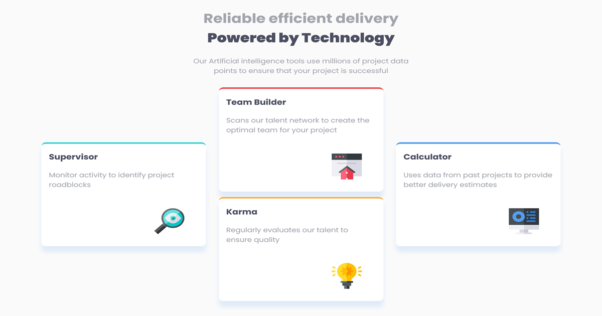

# Frontend Mentor - Four card feature section solution

This is a solution to the [Four card feature section challenge on Frontend Mentor](https://www.frontendmentor.io/challenges/four-card-feature-section-weK1eFYK).

## Table of contents

- [Overview](#overview)
  - [The challenge](#the-challenge)
  - [Screenshot](#screenshot)
  - [Links](#links)
- [My process](#my-process)
  - [Built with](#built-with)
  - [What I learned](#what-i-learned)
  - [Continued development](#continued-development)
  - [Useful resources](#useful-resources)
- [Author](#author)


## Overview

### The challenge

Users should be able to:

- View the optimal layout for the site depending on their device's screen size

### Screenshot




### Links

- Solution URL: [Github repo](https://github.com/akin-holo/frontendmentor-challenge-8-four_cards)
- Live Site URL: [frontendmentor-solution-four-card.netlify.app](https://frontendmentor-solution-four-card.netlify.app/)

## My process

### Built with

- Semantic HTML5 markup
- CSS custom properties
- Flexbox


### What I learned

I learnt more about **Flex layout**. I discovered that *flex property* can give layout as much as Grid. 

I get to understand _align-self, order_ etc.

For instance, see below:

```css
.parent-element {
  display: flex;
}
.child-element {
  align-self: baseline;
  order: 3;
}
```


### Continued development

While I still want to get better understanding of ***flex layout***, I absolutely do not understance **Grid layout**. These are what I will be working on


### Useful resources

- [Wes Bos flex tutorial](https://www.youtube.com/results?search_query=wes+bos+flexbox) - This helped me top know more about flexbox and its layout. I really liked it and I will be using it going forward.


## Author

- Frontend Mentor - [@akin-holo](https://www.frontendmentor.io/profile/akin-holo)
- Twitter - [@AkinHolo](https://x.com/AkinHolo)


